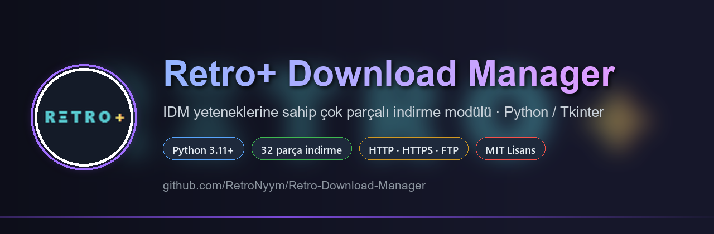

<p align="center">
  
</p>

<p align="center">
  
  
  
  
  
</p>

**Retro+ Download Manager**, çok parçalı (segmentli) indirme, duraklat/devam, kuyruk, zamanlama,
otomatik dosya kategorileri, bağlantı grabber'ı, web sayfası/playlist çözümleme, tarayıcı köprüsü
ve Türkçe Tkinter arayüzü sunan bağımsız bir Python indirme yöneticisidir.

Modül hem **masaüstü uygulaması** hem de **Python kütüphanesi** olarak kullanılabilir — GUI olmadan
`DownloadManager` sınıfını doğrudan kendi programınıza bağlayabilirsiniz.

> Depo adı `Retro-Download-Manager` (GitHub boşluk ve `+` karakterini depo adında kabul etmez),
> ürün adı **Retro+ Download Manager**'dır.

---

## Özellikler

| Özellik | Durum | Not |
| --- | :---: | --- |
| Çok parçalı indirme (paralel segment) | ✅ | Varsayılan 8, en fazla 32 parça |
| Duraklat / devam (her noktadan) | ✅ | 206 Range ile ilerleme dosyasına yazılır |
| Bilinmeyen boyutlu / `Range` desteklemeyen sunucu | ✅ | Tek parça + hazır olan kadar parçalı kademelenme |
| Çelişkili/eksik `Content-Length` çözümü | ✅ | `HEAD` + `Range` teyidi, uzunluk uyuşmazlığında parça sadeleştirilir |
| Zamanlanmış / tekrarlayan indirme | ✅ | Kuyruk + saatlik/günlük planlayıcı |
| Duraklatma sırasında bitiş eşiği ve hız sınırı | ✅ | KB/sn sınırı, isteğe bağlı kota |
| Kategori kuralı (video/müzik/arşiv...) | ✅ | Uzantı + anahtar kelime, eşleşene göre klasöre ayırır |
| Tarayıcı bağlantı grabber'ı | ✅ | Pano izleme + yerel HTTP köprüsü (`/links`, `/add`) |
| Web sayfası / playlist linki çözümleme | ✅ | `og:video`/kaynak tarayıcı + yt-dlp (56 videoluk liste tek tuşla kuyruğa) |
| Hızlı site butonları | ✅ | YouTube, Instagram, X (Twitter), Facebook, TikTok, Vimeo — tek tıkla ekleme |
| Video indirme (ses+video birleştirme) | ✅ | YouTube vb. için yt-dlp + ffmpeg otomatik birleştirme |
| Site şifresi / çerez desteği | ✅ | Başlıklar ve tanımlar üzerinden (`headers`/`cookies`) |
| FTP / FTPS | ✅ | Parçalı FTP indirme, duraklat/devam |
| MMS/RTSP, FTPS'te özel tunnel | ❌ | Desteklenmez |

---

## Kurulum

```bash
git clone https://github.com/RetroNyym/Retro-Download-Manager.git
cd Retro-Download-Manager
python -m pip install -r requirements.txt
```

Tek çalışma zamanı bağımlılığı `requests`'tir; `tkinterdnd2` kuruluysa sürükle-bırak eklenir.

Video/playlist linkleri (YouTube, Vimeo, ...) için opsiyonel olarak `yt-dlp` ve `ffmpeg`
gerektirir; ikisi de kurulu değilse uygulama normal indirmelere olduğu gibi devam eder:

```bash
python -m pip install yt-dlp
winget install Gyan.FFmpeg        # ses+video birleştirme için
```

## Çalıştırma

```bash
python -m download_manager        # GUI (konsolda)
baslat_gui.bat                    # Windows kısayolu (konsolsuz, pythonw)
baslat_gui.vbs                    # Windows: tamamen gizli açılış, hiçbir pencere yok
```

## Kütüphane olarak kullanma

```python
from download_manager import DownloadManager

mgr = DownloadManager(max_tasks=4)          # ayarlar veri klasörüne yazılır
mgr.add(["https://ornek.com/dosya.zip", "https://ornek.com/bolum-01.mkv"],
        segments=16,                        # parça sayısı (1..32)
        speed_limit=2048)                   # KB/sn, None = sınırsız
mgr.start()                                 # kuyruk çalışır
```

Durum, ilerleme ve sonuçlar `mgr.tasks` üzerinden okunabilir; uygulama yeniden başlatıldığında
yarım kalan indirmeler `download_manager/data/state.json` üzerinden kaldığı yerden devam eder.

## Web sayfası ve video linkleri

Adres çubuğuna yapıştırılan link taranır ve doğru motor otomatik seçilir:

| Girdi | Davranış |
| --- | --- |
| Doğrudan dosya (`.zip`, `.mp4`, ...) | çok parçalı HTTP/FTP indirme |
| `.html`/`.htm` uzantılı bağlantı | sayfa dosya olarak iner |
| Web sayfası (uzantısız, PHP, ...) | `og:video`/`<source>`/JSON-LD ile medya adresi çözümlenir |
| Medya bulunamayan sayfa | net hata mesajı, dosya oluşturmaz |
| Playlist / video sayfası (YouTube vb.) | yt-dlp ile liste çözümlenir, tüm videolar kuyruğa eklenir |
| Ses+video ayrı akış (DASH) | yt-dlp indirir, ffmpeg ile tek dosyada birleştirir |
| Site bağlantısı (YouTube/Instagram/X/Facebook/TikTok/Vimeo) | hızlı site butonu → yapıştır → otomatik site çözümleyicisiyle indirme |

Tek parça indirme ayrıca **Site Grabber** (aynı sayfadaki tüm medya bağlantıları) ile de
toplu eklenebilir.

## Tarayıcı köprüsü

Adres çubuğuna yazılan linkleri arayüze taşımak için yerel köprü sunucusu kullanılır
(`http://127.0.0.1:8877`, yalnızca makinenize bağlıdır):

| Uç | Ne yapar |
| --- | --- |
| `GET /links` | pano/grabber'da toplanan linkleri JSON olarak verir |
| `GET /add?url=...` | linki kuyruğa ekler |
| `GET /status` | kuyruk özeti |

Tarayıcıya ekleyebileceğiniz imleç (bookmarklet):

```javascript
javascript:(function(){fetch('http://127.0.0.1:8877/add?url='+encodeURIComponent(location.href))})()
```

## Mimari

| Dosya | Görev |
| --- | --- |
| `download_manager/engine.py` | çok parçalı indirme motoru (HTTP/FTP, duraklat/devam, yeniden deneme, ayna URL) |
| `download_manager/manager.py` | kuyruk, zamanlayıcı, kategoriler, grabber, köprü, geçmiş, ayarlar |
| `download_manager/gui.py` | Tkinter arayüz (kategori paneli, ikonlu araç çubuğu, segment görünürlüğü) |
| `download_manager/extractor.py` | web sayfası medya çözümleme, yt-dlp/ffmpeg köprüsü, playlist genişletme |
| `download_manager/util.py` | kategori tespiti, biçimlendirme, dosya yardımcıları |
| `download_manager/notify.py` | tamamlanma / hata sesli bildirimi |
| `tests/` | 108 kontrol (motor, FTP, köprü, yeniden başlatma, GUI, sayfa/medya) |

## Testler

| Dosya | Kapsam | Kontrol |
| --- | --- | ---: |
| `tests/test_download_manager.py` | çok parçalı, `Range` yok, bilinmeyen boyut, duraklat/devam, iptal, kuyruk, grabber, kalıcılık | 37 |
| `tests/test_restart_resume.py` | kapanınca duraklat → açılınca devam + gerçek internet indirmesi | 8 |
| `tests/test_ftp.py` | FTP parça/duraklat/iptal (`pip install pyftpdlib`) | 10 |
| `tests/test_bridge.py` | köprü uçları (`/add`, `/links`, `/status`) | 7 |
| `tests/test_gui.py` | diyaloglar, hızlı site butonları ve arayüz (ekran/`tkinter` gerektirir) | 24 |
| `tests/test_page_media.py` | web sayfası çözümleme, medya yoksa hata, `.html` davranışı, site adları | 22 |

```bash
python tests/test_download_manager.py
python tests/test_restart_resume.py
python tests/test_bridge.py
python tests/test_ftp.py        # pip install pyftpdlib
python tests/test_gui.py        # grafik oturum gerekir
python tests/test_page_media.py
```

Lint: `python -m pyflakes download_manager`.

## Ekran görüntüsü üretimi

Portal başvuruları için dört ekran görüntüsü tek komutla üretilir (internet
kullanmaz, yerel `Range` destekli sunucu açar):

```bash
python tools/shots.py
# docs/screenshots/gui-downloads.png, gui-add-link.png, gui-grabber.png, gui-settings.png
```

## Başvuru / dağıtım paketi

Yazılım indirme portallarına (global ve Türkiye) yapılacak başvurular için hazır
metinler ve kontrol listesi `docs/submission/` klasöründedir; genel bakış
[SUBMISSION.md](SUBMISSION.md) dosyasındadır.

| Dosya | İçerik |
| --- | --- |
| `docs/submission/metinler-tr.md` | Türkçe kısa/uzun açıklama, künye alanları, ekran görüntüleri, SSS |
| `docs/submission/metinler-en.md` | İngilizce karşılıkları |
| `docs/submission/e-posta-sablonlari.md` | Portal/tanıtım e-postası şablonları (TR + EN) |
| `docs/submission/KONTROL-LISTESI.md` | Hangi portaala başvuruldu, durum, tarih |

## Sınırlamalar

- Tarayıcı entegrasyonu eklenti yerine **yerel köprü + pano izleme** ile sağlanır.
- Sunucu `Range` desteklemiyorsa paralel segment kullanılmaz (tümü doğrudan tamamlanır).
- Video indirmeleri yt-dlp tarafından yürütülür; duraklat/devam yerine iptal→yeniden
  başlatma mantığı kullanılır (tek parça `Range` indirmesi gibi değildir).
- `FTP over explicit TLS` (FTPS) deneme amaçlıdır; bazı sunucularda `MLSD` yerine `NLST`'ye düşer.
- Saloon / çoklu parça her zaman sunucunun izin verdiği kadar hızlanır; hız sınırı istemci tarafıdır.

## Lisans

[MIT](LICENSE) © RetroNyym
